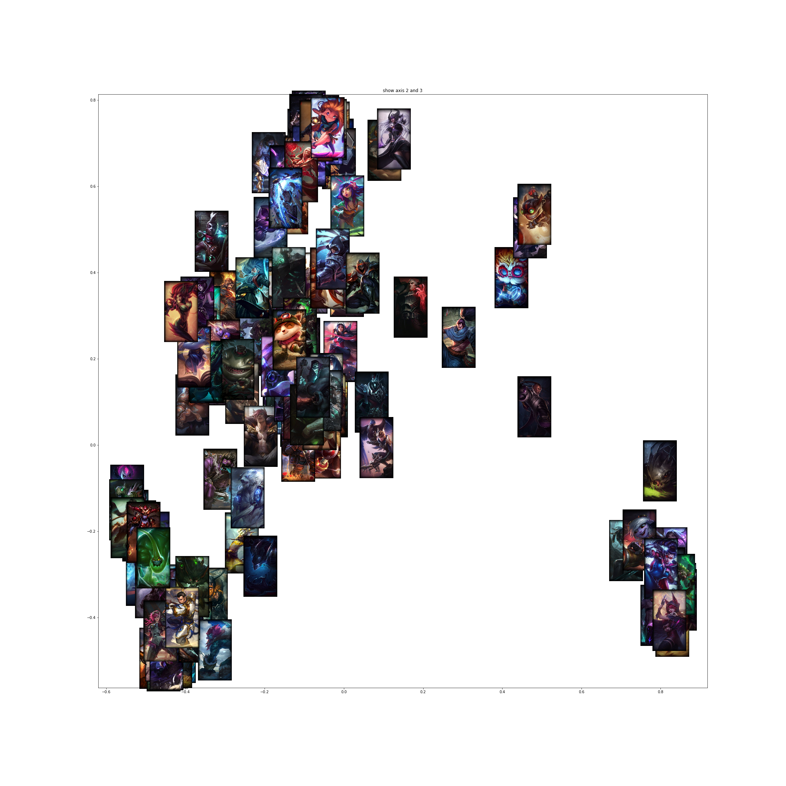

# League Drafter

---

Disclaimer: 
* This is an ongoing work, not much is finalized yet.

* The functions and how they are to be used is not yet really documented. Notebooks in the __Notebooks__ repository illustrate how to use top level classes and functions for each step. Functions are in __model__ folder. Their imports have to be adapted as they are currently configured to run on google colab with this repo in a folder of the google drive called 'Lol'

* Github markdown seems broken for tables / color (in the draft)

---

This repository is centered around the game League Of Legend. The only things we have to know about the game is that it consists of 5 players vs 5 players. In a given game, each player pick a champion. Every champion has
* a role
* strengths
* weakness
* champions he is strong against
* champions he is weak against
* champions he synergize with
* ...

Currently there exists 143 different champions.

Creating a good team composition is difficult. The team composition are chosen during a draft; color indicates team blue or red, and Pick/Ban indicates a Pick (team turn to chose a champion) or a Ban (remove champion from pool of champions). A champion can not be picked twice. The draft (in pro matchs) is:
*  Ban  >  Ban  >  Ban  >  Ban  >  Ban  >  Ban 
*  Pick  >  Pick  >  Pick  >  Pick  >  Pick  >  Pick 
*  Ban  >  Ban  >  Ban  >  Ban  
*  Pick  >  Pick  >  Pick  >  Pick 

The final goal of this project is to create an agent that is able to draft !

For that, 4 parts have been identified:
* [Collect data](#Data-Collection)
* [Create a model to vectorize champions](#Champions-vectorizer)
* [Create a model to predict the winner given two team compositions](#winner-predictor)
* [Train an agent to draft](#Agent-training)

# Data Collection

The data are collected through Riot Games API. We collect the matchs of the 4500 best players (according to their ELO on the solo queue ladder) of the EUW server.

The [API](https://developer.riotgames.com/apis) is really limited :
* 20 requests every 1 second
* 100 requests every 2 minutes

We then Collect their most recent matchs, and store the 5 champions of each team and the eventual winner.
I Currently train on around 30k matchs. Due to the fact that reccurent patchs change champions strength, it is detrimental to take 
matchs that are too old.

This part is not really robust as I dont aim at re running it regularly.

It is to be noted that our dataset will be really biased, as no player is able to play every single one of the 143 champions. More on the bias in each phase after. 

# Champions vectorizer

The first step is to create a Champion2Vec model. It is essentially a word2vec: A neural net with one hidden layer, an input of size 'numer of champions', an output the same size with a softmax. The input it is fed is a team amputated from one of its members, and it aims at predicting the removed champion.

We can then vizualize how champions are represented in the latent space:

Without too much details, we find:
* range champions with physical damages bottom right
* magical damages champions at the top
* ...

We can see how efficient we are at recomposing a team:

Team: Gragas, Ornn, Taric, Zoe, Kalista
Remove: Kalista
Top 5 probabilities of the encoder fed Gragas, Ornn, Taric, Zoe: 

order in proba | champion
--- | --- 
0|       Ezreal
1|      Kalista
2|     Aphelios
3|        Varus
4| Miss Fortune

The manifestation of the bias of our data set here, is that we suppose teams are coherent, and we can say something about a champion given the rest of his team. But this is from a solo queue ladder where some people can sometime play only one champion (even in the 4500 best players of Europe): Hence the champion can be completely independant from his 'context'.

# winner predictor

In this phase we aim at predicting the winner of the match given the composition of the red and the blue side.

The model is a deep neural net, with two inputs, one for each team composition. Each input goes though the vectorizer defined above (that is not trainable at this step).

(Currently is seems to work better without the vectorizer)

I only reach a score of 53.6% at best for now.

Two points to have in mind to make this mediocre result milder:
* team composition is not the first factor of the winner (player skill during the game, fairness in terms of ELO of the current match, luck, players ability to communicate through a chat while playing, players having the same vision of the game ...)
* people at this level are experienced enough to spot when their team composition has no chance to win against the ennemy team composition, and they can dodge the game for a minimal ELO loss. The dataset contains few games "that are lost since champion selection".

Hence almost 4 points of determination is not that bad !

# Agent training

And then the final step (nothing on the repo yet)
Our agent has to take an action for each phase of the draft, against an other agent.
When the episode consisting of one draft is over, we can evaluate our agent policy thanks to our "oracle" that we just made.

